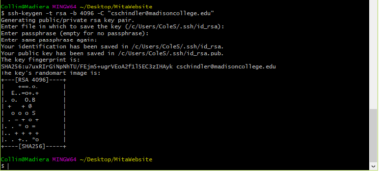
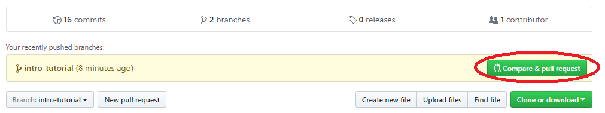

# Git Tutorial / Introduction steps
## [Download Git Bash](https://git-for-windows.github.io/)
* This step isn't "necessary", but highly recommended, because this is what I use personally.
	* Very rarely do we use GUI tools in any of the classes, but if you master the Bash shell, the GUI version is a piece of cake
## Create Your Project
#### Skip this if you are connecting to an existing project
* Create your profile using your madisoncollege.edu account (Change the default avatar... Only newbies have the default avatar)
* Go to your profile
	
* Click the Repositories Tab
	
* Click the New Repository link
	
* Add everything for your project
	* Name
	* Description
	* Visibility (Unless this is changed, you get 5 private repositories on GitHub)
	* Every repository should have a readme.md. It doesn't have to be made on creation, but there should be one as an intro to the project.
	
* Voila! You have created your project!
	* Take note of the red circles and what infomation is conveyed in each one
		* URL - Provides the path to your project and quick navigation to your other projects
		* Current Branch - Be aware of which branch you are on and where you would like to be
		* Latest commit - Always make sure that you are up to date with the current version of the code
		* Clone/Download - Important to tie your local workspace with GitHub
		* README.md - Information about your project and You as a developer
	
## Migrating a Project to your Local Workspace
* Add / Make an ssh key
	* Check if you have an existing ssh key on your machine (it will contain files named id_rsa and id_rsa.pub)
	
	* Trying to copy the repo without this key will give you this error
	
	* Generate a key (If you determined that you already have a key, do not generate a new one)
		* The defaults for all of the options are usually good enough
		* You can add a passphrase, but it usually just complicates things so I don't
	
	* You must then activate / assign your key to your machine
		* You may need to do this everytime you access Git Bash or set it to [Auto Launch](https://help.github.com/articles/working-with-ssh-key-passphrases/)
	
* Add your ssh public key to your GitHub profile
	* Use the command `$ clip < ~/.ssh/id_rsa.pub` to copy your public key to the clipboard
		* Or open this file in a text editor and copy it that way if clip isn't installed
	* Navigate to the settings part of your profile to add the SSH key
	
	* Click the "SSH and GPG keys" tab and "New SSH key"
	
	* Paste your key into the box and give it a name that will help you remember what this key is attached to
	
* You are now ready to copy this project to your local workspace!
* Clone / Fork the repository
	* Cloning and Forking can seem pretty similar, so here is a quick definition
		* Clone - Take a direct copy of the repository and put that in your local workspace.
		* Fork - Make a copy of the repository at that exact instant, and make a copy for yourself under your profile
	* Typically you will see a general project on GitHub. You will make a fork of that project. You will then clone that project into your workspace.
	
	* You can clone the repository by clicking the "Clone or download" button
		* Make sure you are cloning the SSH, not the HTTPS link
	
	* Doing this successfully, you should see no error messages and a transfer of files contained in the repo
	
	* You can confirm this by looking in the folder and seeing the newly created project with all of the contents of the repo
	
* Woot! You did it!
## Adding Remotes to your Workspace
* Ideally, you now have a fork of a project and that project is cloned into your local workspace, so how do you talk between these things?
	* You will set up a remote to your forked version, and another remote to the original version
		* You can see your remotes with `git remote -v`
	
	* You will need to add a remote to the original with `git remote add <remote name> <path to repo>`
	
## How to get your changes to the "Master" Repository
* Once you have made changes to your fork and you would like the master repository to get your changes, you will go through the process of "merging" your code into the master project
	* You do this by submitting a 'merge' or 'pull' request.
		* You are saying that your fork contains code that the master user should pull or merge into the master project because it contains code that benefits the project.
	
		* Fill in all the information
			* There are locations to assign tasks to people on the project
			* Ensure you are requesting the proper branches to be merged / pulled from
		* The assigned user will review this request and can choose to decline or accept this request. 
	
	* NOTE: ALWAYS MAKE A PULL FROM THE MASTER PROJECT BEFORE SUBMITTING A MERGE REQUEST!!
		* i.e. `git pull upstream <branch name you are submitting>`
#### This concludes the Tutorial. More can be added based on questions you have. Check out the [Git Documentation](https://git-scm.com/docs) for more fun things you can do with Git!
